# YouTube

Welcome to the our YouTube App! 
This project allows users to search for and view YouTube videos. 
It is built with React and styled-components.

## Features
- Search for videos
- View video details
- Responsive design
- Infinite scrolling for search results
- Play, edit and delete videos
- Comment, Like and download videos
- Dark mode toggle
- Login and Register

### Demo

First you have the main page of the app:
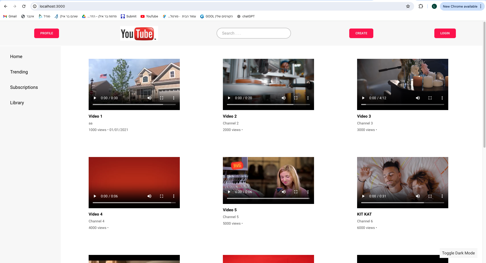

Search video using the search box:

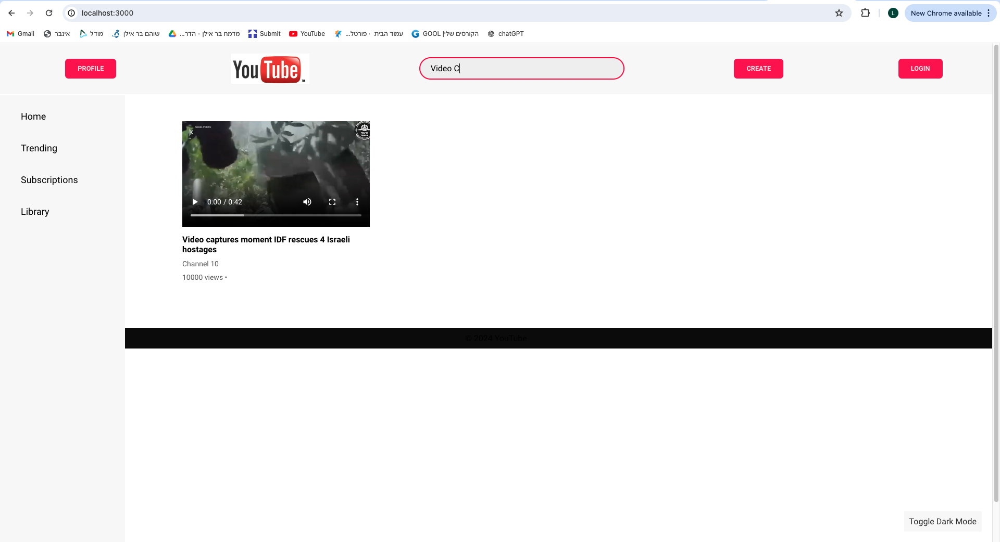

You can login by pressing the Login button:

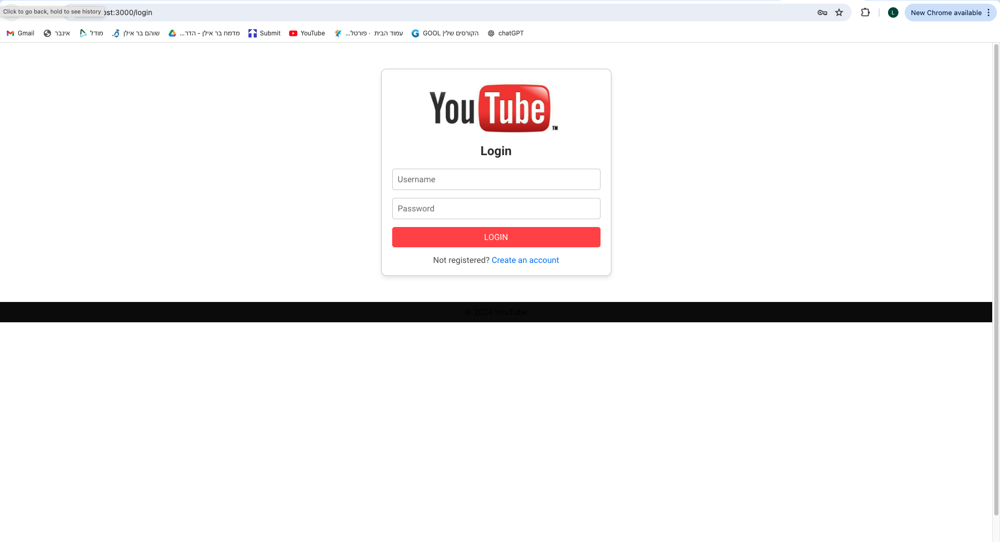

Create a new account if you don't have one:

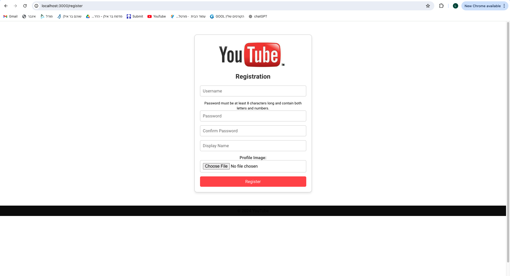

After login is complete, pressing on the profile button will show your details:

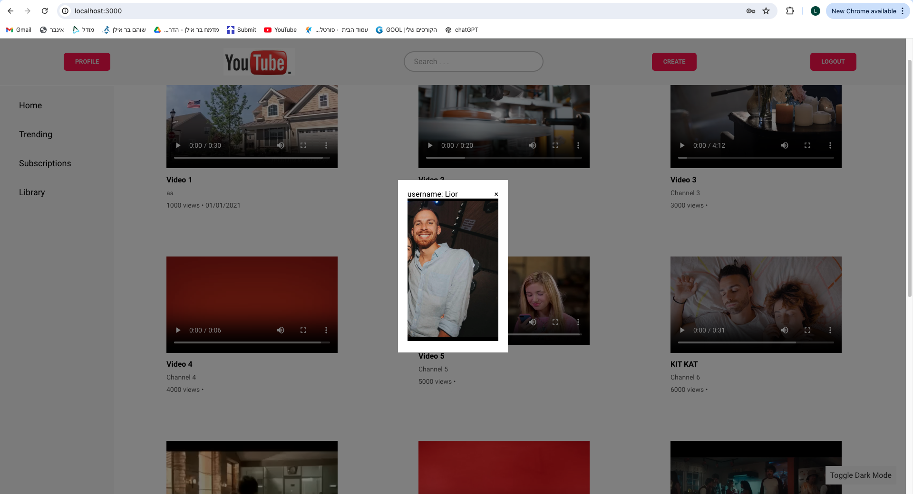

You can open a video and share a Comment, Like or Dislike, and even download it!

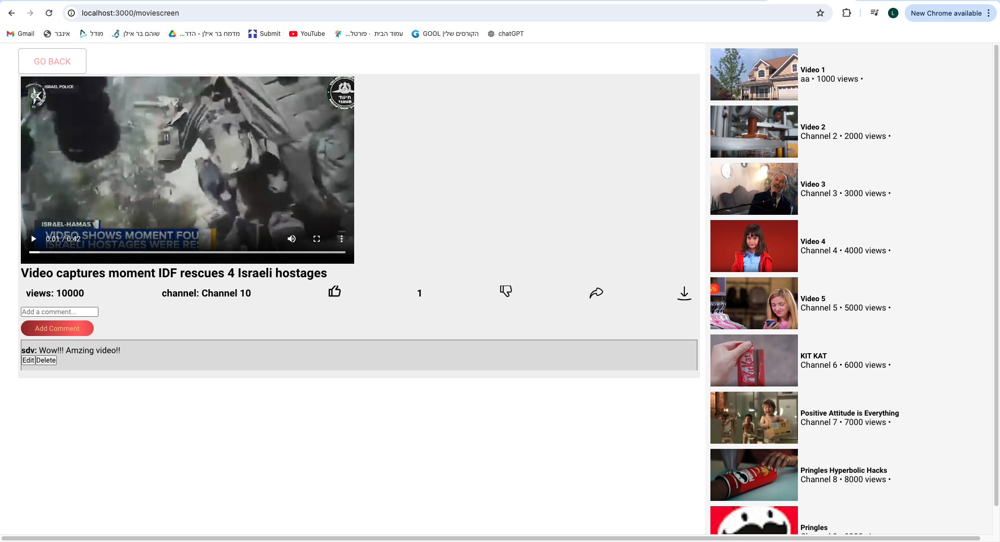

Navigate using the sidebar:

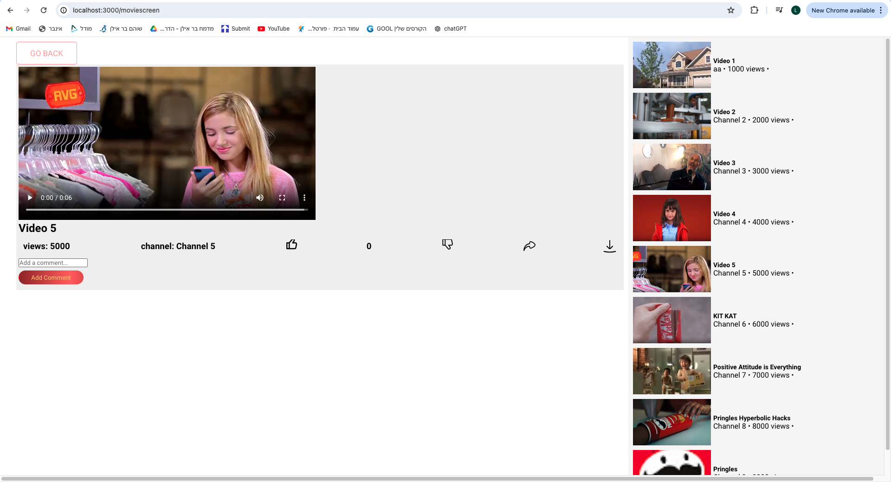

Create a new video:

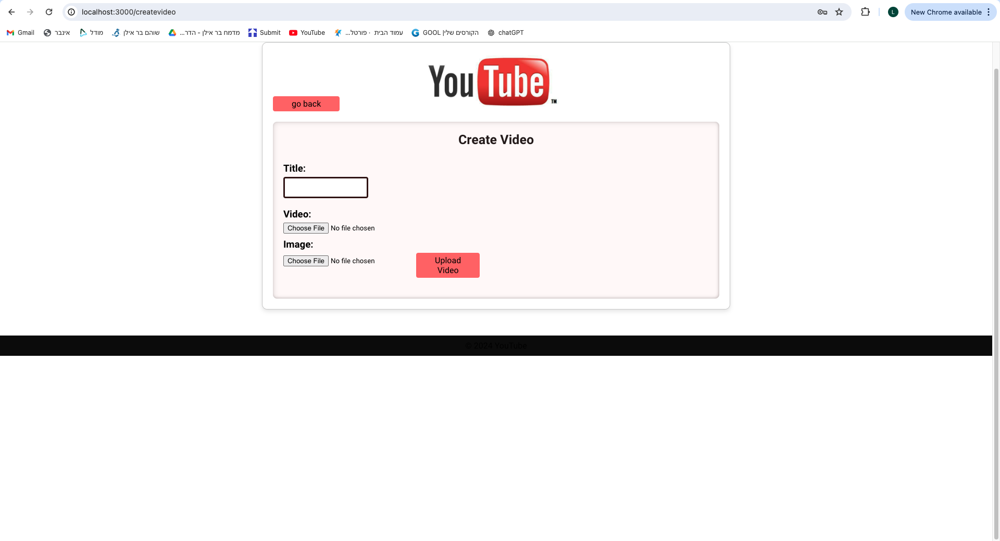

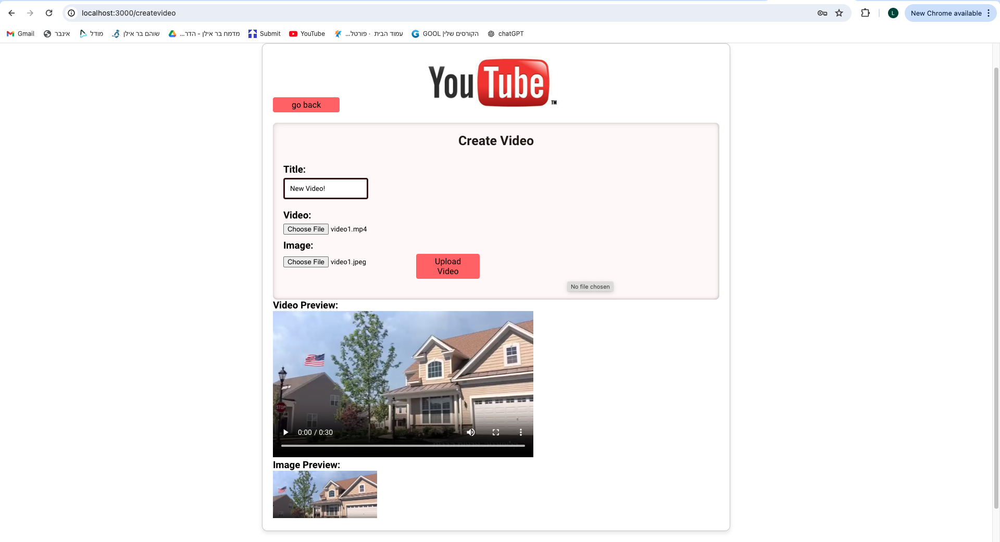

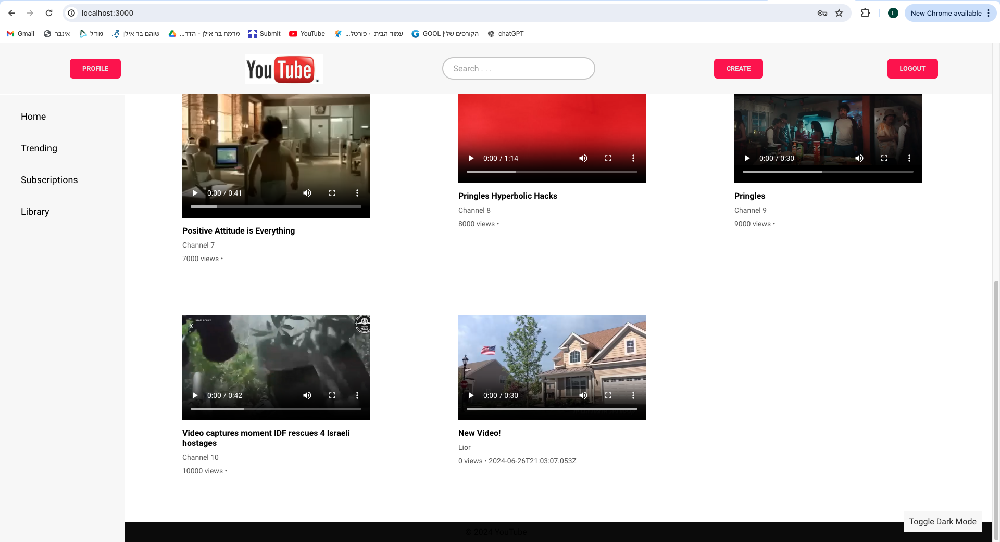

When you upload a video, you can edit its name and even delete it!

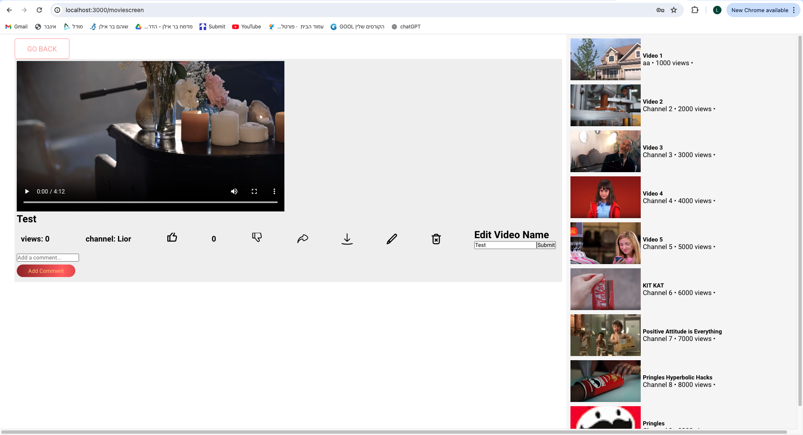

## Installation

To run this project locally, follow these steps:

- Clone the repository

>git clone https://github.com/YTGroupBiu2/YouTube

- Change to your ip in these two paths

> $YourClonedProject/YouTube\Android\app\src\main\res\xml\network_security_config.xml
> $YourClonedProject/YouTube\Android\app\src\main\java\com\example\newyoutube\Strings.java

- First install MongoDB and connect to local host 

> mongodb://localhost:27017

- Navigate to the backend folder

> cd $YourClonedPrject/backend

- Run the server

> node ./server.js

- Navigate to tcp_server and compile using this command

> g++ -o program.exe server.cpp -lws2_32

- Open the file program.exe that shows up

- To run the clinet, Open new terminal and navigate to the web directory

> cd > cd $YourClonedPrject/Web

- Run the client

> npm start

- The app should now be running on http://localhost:3000.

## About the Project

This project was created by a team of three members: Michael, Roni, and Lior. Each team member was responsible for different aspects of the application, ensuring a collaborative and comprehensive development process.

### Team Members

- **Michael**: Responsible for developing the video page. Michael implemented the video player, video playback, and designed the layout for displaying video details and related videos.

- **Roni**: Handled the registration and login pages. Roni implemented he login and registration functionalities, ensuring a smooth and safe user experience.

- **Lior**: Focused on the homepage. Lior developed the main interface of the application, including the search bar, featured videos, and overall layout of the homepage, ensuring it is user-friendly and visually appealing.
